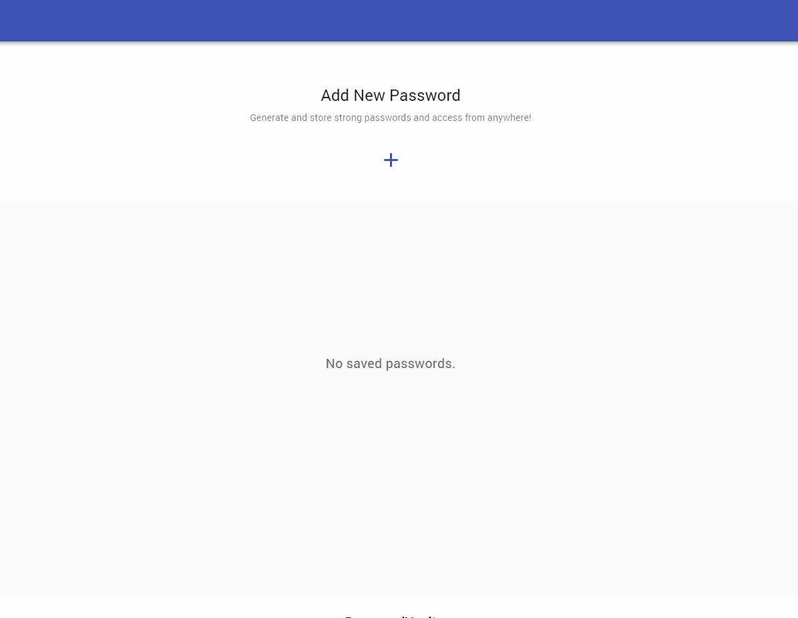

# PasswordManager

PasswordManager is a secure and intuitive password management tool built with React and TypeScript. It enables you to generate and store strong, random passwords, ensuring your online accounts remain safe. With cloud synchronization, you can access your saved passwords from anywhere, at any time.

<p align="center">
  
</p>

## Features
- Generate highly secure, random passwords with customizable options.
- Store your passwords securely in the cloud using [Firebase](https://console.firebase.google.com/).
- Encrypt all saved passwords using [cryptoJS](https://www.npmjs.com/package/crypto-js) for an extra layer of security.
- Retrieve and manage your saved passwords easily.
- Authenticate securely using your Google account via [Firebase Authentication](https://firebase.google.com/docs/auth).

## Getting Started
### Prerequisites
- Node.js installed
- Firebase account and project setup

### Installation
1. Clone the repository:
   ```sh
   git clone https://github.com/yourusername/PasswordManager.git
   ```
2. Navigate to the project folder:
   ```sh
   cd PasswordManager
   ```
3. Install dependencies:
   ```sh
   npm install
   ```
4. Set up Firebase:
   - Create a Firebase project
   - Enable Authentication (Google Sign-In)
   - Set up Firestore for storing passwords
   - Configure Firebase SDK in `.env` file

### Usage
1. Start the development server:
   ```sh
   npm start
   ```
2. Open the application in your browser at `http://localhost:3000`
3. Sign in with your Google account.
4. Generate, store, and manage your passwords securely.

---

Start securing your passwords today with PasswordManager!

